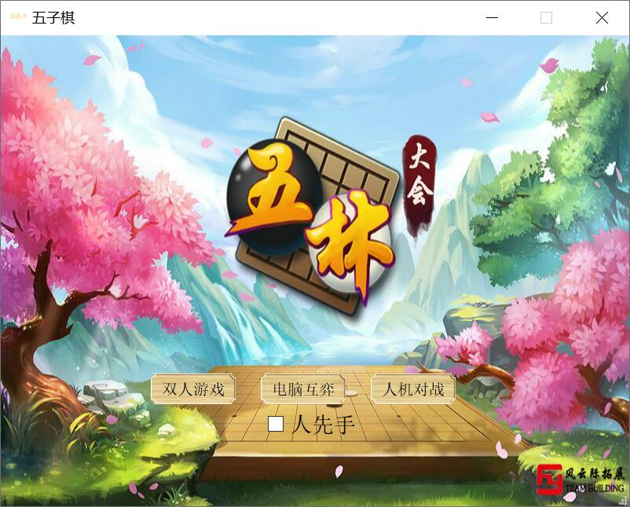
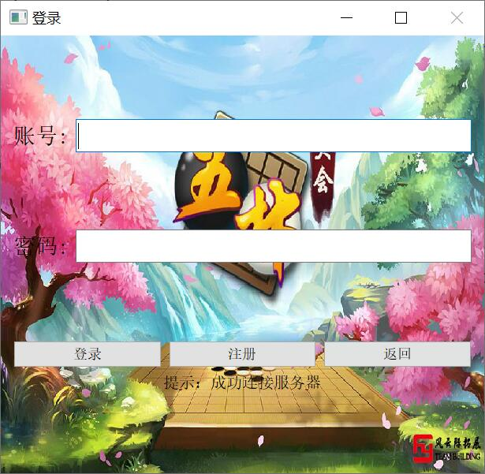
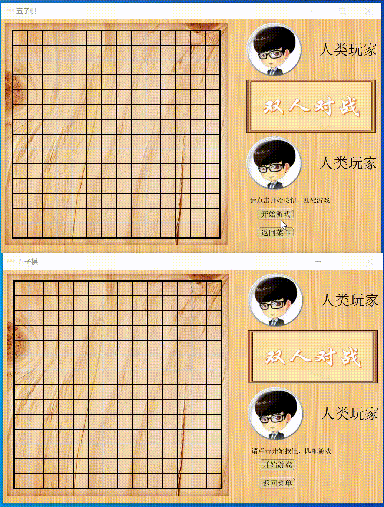
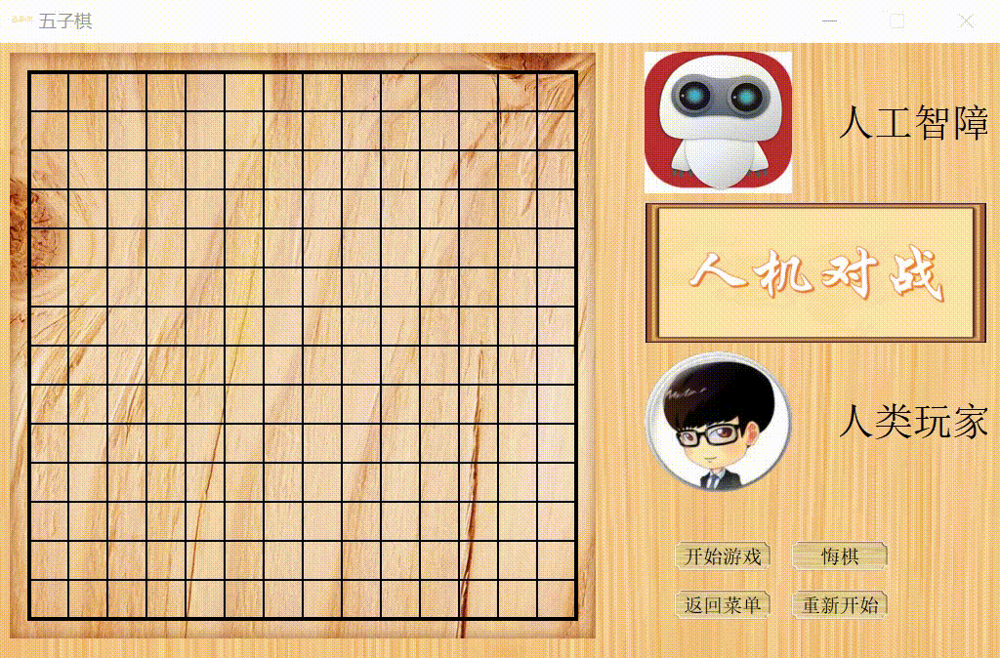

# WebGobang
可网络对战的五子棋游戏，服务端是是基于epoll的多线程并发模型、客户端使用QT框架编写。具有登录注册、对局匹配等功能。
## 客户端
五子棋项目分为服务端和客户端，客户端可以选择双人游戏模式、人机模式、电脑互弈模式。其中双人模式需要使用TCP连接客户端。单机模式下客户端可以独立运行。



## 服务端
服务端运行在linux系统上，服务器上需要安装mysql服务器和客户端，以及mysql的c语言开发工具包。使用make编译后运行服务器程序，使用8000端口号。./server 8000
服务器主要用于登录注册检验、匹配对局、传递对局信息，服务器上需要创建数据库和用户表。
```
create database webdb;
USE webdb;
CREATE TABLE user(
    username char(50) NULL,
    passwd char(50) NULL
)ENGINE=InnoDB;
```
客户端登录账号连接服务器


双人游戏演示


## 电脑AI
电脑AI采用计分策略，对与棋盘上每个点计算与该点相关的五元组得分信息，选择得分最高的点落子。
五元组计分规则如下,AI效果还不错。
```
    //权值计算，0代表空，1代表当前棋子，2代表对方的棋子
    scoretable["00000"] = 7;
    scoretable["00001"] = 35;
    scoretable["00011"] = 800;
    scoretable["00111"] = 15000;
    scoretable["01111"] = 800000;
    scoretable["00002"] = 15;
    scoretable["00022"] = 400;
    scoretable["00222"] = 1800;
    scoretable["02222"] = 100000;
```


## 完整项目和可执行文件
[百度云](https://pan.baidu.com/s/1p2ArnssJ5WBnyNc-d0gcrA ) 提取码：4g31


